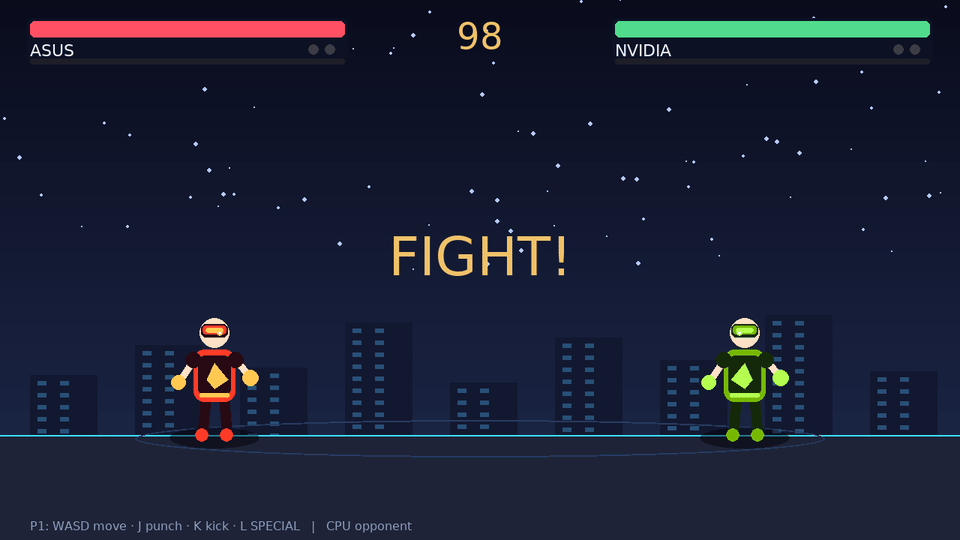
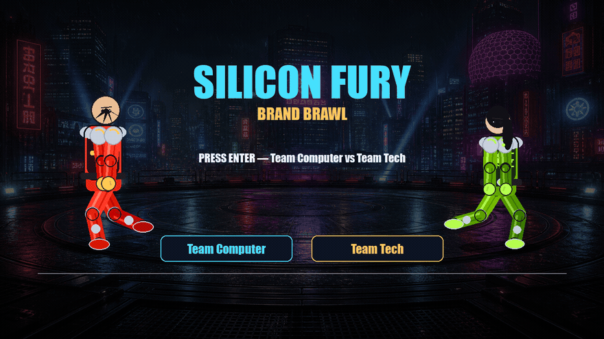
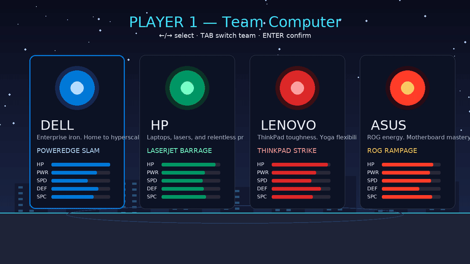
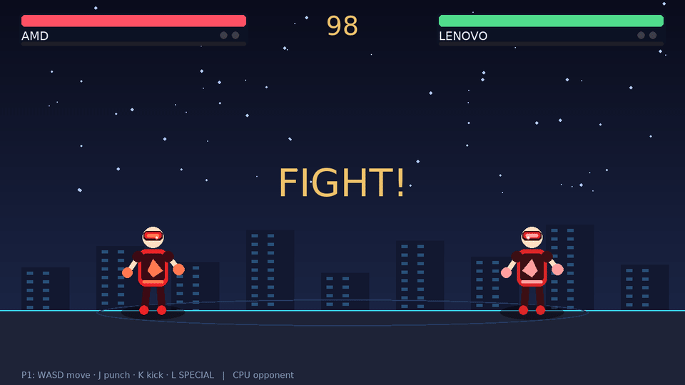
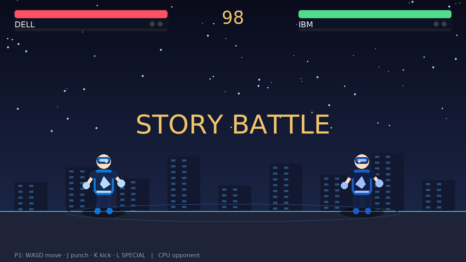

# SILICON FURY

**Brand Brawl** — a browser fighting game where PC makers collide with silicon titans.

Rebuilt in **TypeScript + Canvas** with **human skeletal animation** (smooth walk, punch, kick, dash, aerials, specials). No sprite boxes. No black rectangles.

<p align="center">
  <a href="https://btstevens1984az.github.io/Silicon-Fury/"><strong>▶ Play in browser</strong></a>
</p>

<p align="center">
  
</p>

---

## Play

### Online
**[btstevens1984az.github.io/Silicon-Fury](https://btstevens1984az.github.io/Silicon-Fury/)**

### Local

```bash
git clone https://github.com/btstevens1984az/Silicon-Fury.git
cd Silicon-Fury/web
npm install
npm run dev
```

Open the URL Vite prints (usually `http://localhost:5173`).

---

## Live gameplay

### 1. Title & teams


### 2. Character select


### 3. Versus brawl


### 4. Special moves


### 5. Story K.O.


---

## Why this rebuild

The old Python/pygame build rotated opaque sprites and left **black rectangles** behind fighters. Motion was stiff pose-snapping.

This version:

- Draws fighters as **articulated skeletons** (paths only — never offscreen black surfaces)
- Uses **keyframed human motion** with anticipation, follow-through, and easing
- Feels like a fighter: **dash, double-jump, punch strings, air kicks, specials, hitstop, screen shake**
- Runs in any modern browser (GitHub Pages)

---

## Controls

| Action | Player 1 | Player 2 |
|---|---|---|
| Move / sprint | `A` `D` · hold `Shift` | `←` `→` · `RShift` |
| Dash | `Shift` + `A`/`D` | `RShift` + arrows |
| Jump (double-jump) | `W` | `↑` |
| Block | `S` | `↓` |
| Punch (string into 2nd hit) | `J` | `N` |
| Kick / air kick | `K` | `M` |
| Special (meter ≥ 55%) | `L` | `,` |

Menu: `Enter` · `Esc` · `Tab` switch team on select.

---

## Roster

### Team Computer
| Fighter | Special | Style |
|---|---|---|
| **DELL** | POWEREDGE SLAM | Tank bruiser |
| **HP** | LASERJET BARRAGE | Mid pressure |
| **LENOVO** | THINKPAD STRIKE | Counter |
| **ASUS** | ROG RAMPAGE | Rushdown |

### Team Tech
| Fighter | Special | Style |
|---|---|---|
| **IBM** | WATSON WAVE | Zoning |
| **INTEL** | CORE MELTDOWN | Flurry |
| **AMD** | RYZEN RUSH | Chip damage |
| **NVIDIA** | CUDA CANNON | Beam special |

---

## Modes

| Mode | Description |
|---|---|
| **1v1** | Two players, one keyboard |
| **1v CPU** | Fight a rival-team AI |
| **Story** | Climb the opposing roster |

---

## Project layout

```text
Silicon-Fury/
├── web/                 # ← playable game (TypeScript + Vite)
│   ├── src/
│   │   ├── anim/        # Keyframe clips + skeleton renderer
│   │   ├── fighter.ts   # Movement / combat state
│   │   ├── effects.ts   # Blood / fire / explosions
│   │   ├── game.ts      # Menus + fight loop
│   │   └── …
│   └── public/arena.png
├── media/gifs/          # README gameplay GIFs
├── silicon_fury/        # Legacy Python prototype (archived)
└── .github/workflows/   # GitHub Pages deploy
```

### Regenerate GIFs

```bash
cd web
npx playwright install chromium
npm run capture
```

---

## License

MIT — see [LICENSE](LICENSE).

> Brand names used fictitiously for parody/fan entertainment. Not affiliated with Dell, HP, Lenovo, ASUS, IBM, Intel, AMD, NVIDIA, or Bandai Namco.
